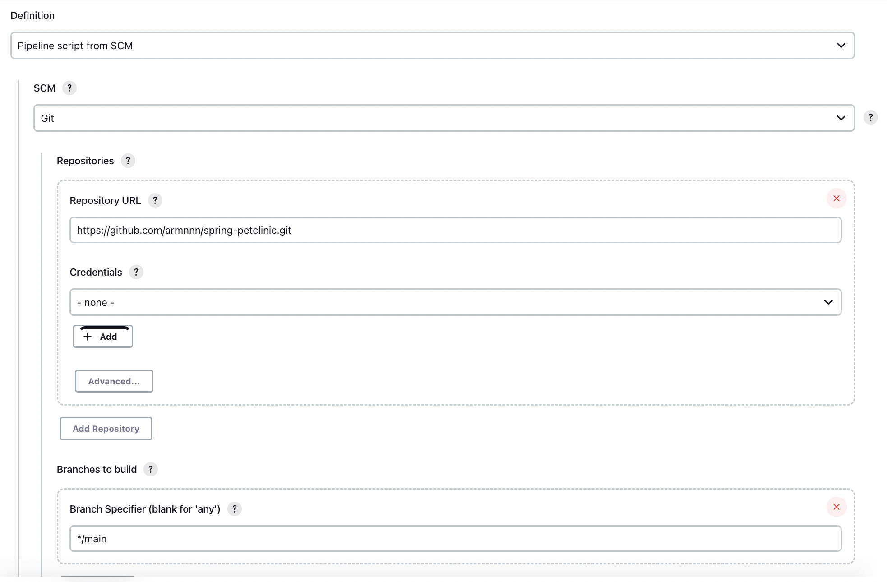

This document leads you through the process of 

Requirements:
In order for this demo to work following tools should be installed on the users machine

`docker` tested with `v20.10.21`
`jenkins` tested with `v2.375.1`
`git` tested with `v2.25.1`

We're using Artifactory to host our Docker images, an account for the jFrog Platform is needed, using the Free Trial Cloud Solutions is the easy solution.

# Jenkins Set up
## Required Plugins
After Jenkins is launched the initially, install the suggested plugins on the onboarding screen, on top of
that we need to install additional plugins [Docker Pipeline plugin](https://plugins.jenkins.io/docker-workflow/) and the [Artifactory plugin](https://plugins.jenkins.io/artifactory/)


## Configure Secrets
Inside Jenkins create [new credentials](https://www.jfrog.com/confluence/display/JFROG/Configuring+Jenkins+Artifactory+Plug-in) for the Artifactory Authentication. For this demo, the id of the credentials is `artifactory-username-pw` 

## Set Up Pipeline
On the Jenkins dashboard, click new item, give it a name and select pipeline and copy the configuration from the Screenshot



# Jenkins File Explanation
**Note**, I didn't parameterize the Jenkins file, since it's easier for you to see what is happening, and you can directly see the values of the variables. In a prod environment you should move vaules to variables instead of hardcoding them.

The Jenkinsfile consists of 7 Steps

1) Artifactory configuration

This steps sets up the configuration for the Artifactory plugin, we're creating a ArtifactoryServer with the ID `ArminDemo` that is then later being referenced to push the docker image. The URL is provided by the jFrog Cloud Solution, and the `credentialsId` is configured through the Jenkins UI and referenced here.

2) Checkout

We pull the Repo from the main branch

3) Compile

According to the instructions send by email, we need to compile everything first. In order to do this, we launch a docker container with openjdk-18 and compile everything.
`-Dcheckstyle.skip` is set because it throws errors when `http` is used instead of `https`, and currently the code uses `http`. `mvn clean` in order to remove the previously created files

4) Test

Like in the email defined, run the tests as the next step. Like in the previous step the `maven:3.8.6-openjdk-18` container is used and we skip style checks.

5) Package

We compile the application into a `.jar` so we can execute it later on. Using the same container as before, we're skipping tests since we've done them before

6) Build docker image

We're using the docker plugin to build the image, `armindemo.jfrog.io/docker/spring-clinic` and tag it with the `latest` tag. This could be improved, we could tag the images with the commit sha, to make rollbacks faster. (See Future Improvements). We'er using the Dockerfile from the root of the repo to build the image.

```
FROM openjdk:19-jdk-alpine3.16

ADD target/spring-petclinic-2.7.3.jar /usr/bin/app.jar

ENTRYPOINT ["java", "-jar","/usr/bin/app.jar", "--server.port=8080"]

EXPOSE 8080
```

It's using the openjdk-19 alpine as the base image. We copy the compiled `.jar` file to `/usr/bin/app.jar` within the image. When `docker run` is executed `java -jar /usr/bin/app.jar --server.port=8080` is executed and launches the app on port 8080 which is exposed. See How To Run section for more information


7) Push image to Artifactory

Now we push the docker image that was created in the previous step to our Artifactory Docker Repositiory.
The serverId references the server created in step 1. Image was created in the previous step. Target Repo is a Local Repo created in Artifactory. And we add additional metadata


# How to Run
`docker run -p 9090:8080 armindemo.jfrog.io/docker/spring-clinic` launches the build images, and you can access it through `localhost:9090`, to change ports, change `9090:8080` to `NEW_HOST_PORT:8080`, where `NEW_HOST_PORT` is the new port

# Future Improvements
* Improve the tagging, instead of labeling everything `latest` we could use the commit sha, so if there is a problem and we need to roll back we can easily check what the last working version was and use this to update the image
* Create pipeline for other branches, so you have continous testing while developing
